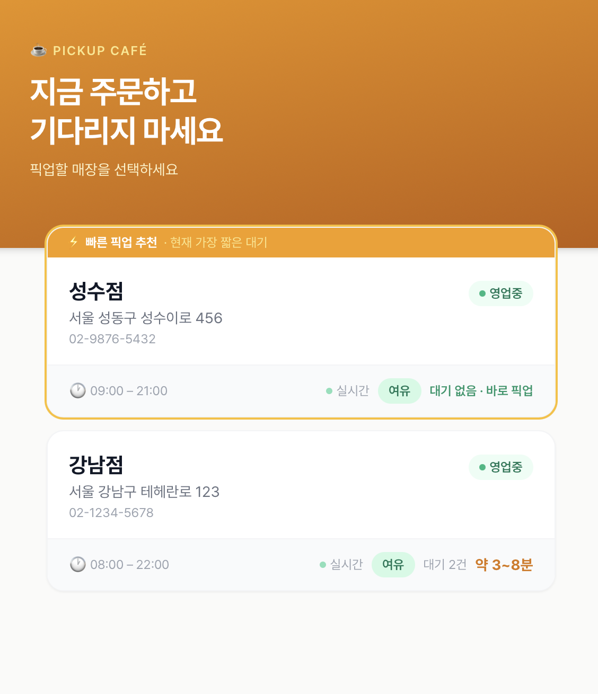
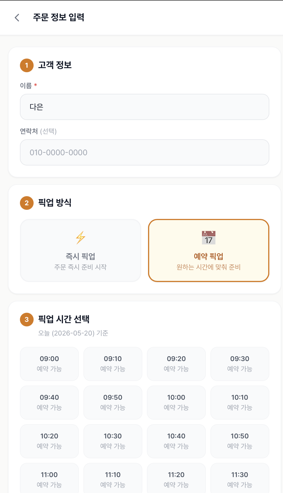
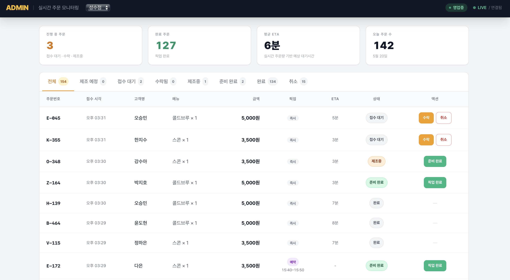
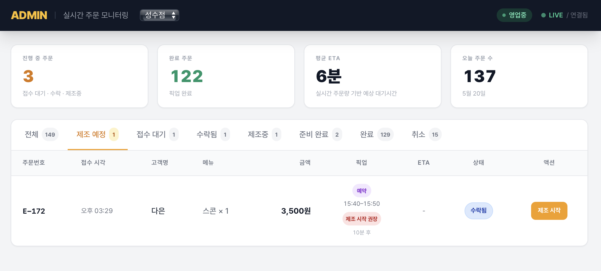

# 실시간 주문 상태 및 ETA 관리 시스템

> 고객은 주문 전에 대기시간을 확인하고, 관리자는 주문 흐름을 실시간으로 운영할 수 있는 픽업 주문 관리 시스템

<br>

## 목차

1. [프로젝트 개요](#1-프로젝트-개요)
2. [문제 정의](#2-문제-정의)
3. [스크린샷](#3-스크린샷)
4. [기술 스택](#4-기술-스택)
5. [핵심 기능](#5-핵심-기능)
6. [시스템 구조](#6-시스템-구조)
7. [핵심 구현 로직](#7-핵심-구현-로직)
8. [트러블슈팅](#8-트러블슈팅)
9. [프로젝트 회고](#9-프로젝트-회고)

<br>

---

## 1. 프로젝트 개요

스타벅스에서 주문을 하고 나면 "언제 나오냐"는 걸 알 수 없어서 카운터 앞을 서성이게 되는 경험이 있었습니다. 바쁜 시간대엔 대기가 얼마나 되는지 알고 싶어서 들어갔다가, 줄이 너무 길어서 그냥 나오기도 했습니다.

이 불편함을 직접 해결해보고 싶었습니다. 고객이 주문 전에 현재 대기 상황을 확인할 수 있고, 주문 후엔 내 음료가 어디까지 진행됐는지 실시간으로 볼 수 있다면 어떨까 — 그 질문에서 이 프로젝트가 시작됐습니다.

기능을 쌓다 보니 자연스럽게 운영자 시점도 생겼습니다. 주문이 들어오는 걸 실시간으로 파악하고, 예약 주문이 언제 제조에 들어가야 하는지를 놓치지 않으려면 관리자 화면도 함께 설계해야 했습니다. 그 결과, 고객 주문 흐름과 운영 대시보드가 소켓으로 연결되는 하나의 시스템으로 완성됐습니다.

| 항목 | 내용 |
|---|---|
| 개발 기간 | 2025년 |
| 개발 인원 | 1인 |
| 개발 환경 | Node.js, React, PostgreSQL |

<br>

### 주요 기능

✅ 실시간 ETA 기반 주문 대기시간 제공  
✅ 즉시 픽업 / 예약 픽업 선택 지원  
✅ 관리자 실시간 주문 대시보드 (Socket.IO)  
✅ 제조 예정 탭 기반 예약 주문 운영  
✅ 주문 상태 변경 시 고객·관리자 화면 동시 반영  

<br>

---

## 2. 문제 정의

### 고객 입장

- 주문하기 전에 지금 대기가 얼마나 되는지 알 수 없음
- 주문 후 내 음료가 언제 나오는지 알 수 없어서 카운터 근처를 떠나지 못함
- 예약 픽업 기능이 있어도 슬롯이 얼마나 남았는지 보이지 않으면 신뢰하기 어려움

### 운영자 입장

- 새 주문이 들어왔는지 수시로 확인해야 하고, 화면을 새로고침하지 않으면 인지가 늦음
- 예약 주문이 일반 주문과 섞여 있으면, 픽업 시각이 다가와도 제조 시작 타이밍을 놓치기 쉬움
- 주문 상태가 어디까지 진행됐는지 한눈에 보이는 구조가 없으면 운영 실수가 잦아짐

<br>

---

## 3. 스크린샷

| 고객 첫 화면 (매장별 ETA) | 메뉴 및 예약 픽업 화면 |
|---|---|
|  |  |
| 매장별 혼잡도(여유 / 보통 / 혼잡)와 예상 대기시간을 주문 전에 확인할 수 있습니다. | 즉시 픽업과 예약 픽업을 선택할 수 있으며, 원하는 시간대에 맞춰 사전 주문이 가능합니다. |

| 관리자 주문 관리 대시보드 | 제조 예정 탭 및 reminder badge |
|---|---|
|  |  |
| 실시간으로 주문 현황을 확인하고 상태를 전환할 수 있습니다. KPI 카드로 오늘의 운영 현황을 한눈에 파악합니다. | 예약 주문을 별도 탭으로 분리하고, 픽업 시각까지 남은 시간을 reminder badge로 표시해 제조 타이밍을 놓치지 않도록 합니다. |

<br>

---

## 4. 기술 스택

| 영역 | 기술 |
|---|---|
| Backend | Node.js, Express 5, TypeScript |
| ORM / DB | Prisma ORM, PostgreSQL |
| 실시간 통신 | Socket.IO |
| Frontend | React 18, TypeScript, Vite |
| 상태 관리 | Zustand |
| 스타일링 | Tailwind CSS |
| 라우팅 | React Router v6 |

<br>

---

## 5. 핵심 기능

### 고객 기능

**매장 선택 화면**
- 매장별 현재 대기 주문 수, 예상 대기시간 범위(예: 6~11분), 혼잡도(여유 / 보통 / 혼잡) 실시간 표시
- 대기가 가장 짧은 매장에 "빠른 픽업 추천" 배지 자동 표시
- 대기 없는 매장은 "바로 픽업 가능"으로 강조

**메뉴 선택 화면**
- 화면 상단에 현재 대기 정보 고정 표시 — 메뉴를 고르기 전부터 대기 상황 인지 가능
- 혼잡도에 따라 배너 색상 변경 (여유: 초록, 보통: 주황, 혼잡: 빨강)

**주문 화면**
- 즉시 픽업 / 예약 픽업 선택
- 예약 픽업 시 슬롯별 예약 가능 여부 및 마감 임박 표시
- 잔여 슬롯이 2개 이하일 경우 "마감 임박"으로 자동 전환

**주문 추적 화면**
- 주문 접수 → 제조중 → 준비 완료 → 픽업 완료 단계 실시간 표시
- 준비 완료까지 남은 시간을 카운트다운 링으로 시각화
- 대기열 내 내 순서 실시간 업데이트
- 준비 완료 시 주문번호 강조 표시 (카운터 수령 안내)

---

### 관리자 기능

**실시간 주문 모니터링 대시보드**
- Socket.IO 기반 실시간 연결 — 새 주문이 들어오면 새로고침 없이 즉시 반영
- LIVE 인디케이터로 연결 상태 실시간 표시
- 다중 매장 전환 운영 지원

**KPI 카드**
- 진행 중 주문 수 / 오늘 완료 주문 수 / 평균 ETA / 오늘 총 주문 수 한눈에 확인

**주문 상태 관리**
- 상태별 탭 필터: 전체 / 제조 예정 / 접수 대기 / 수락됨 / 제조중 / 준비 완료 / 완료 / 취소
- 원클릭 상태 전환: 접수 대기 → 수락 → 제조 시작 → 준비 완료 → 픽업 완료

**제조 예정 탭**
- 예약 주문 중 아직 제조 시작 전인 것만 별도 분리
- 픽업 시각까지 남은 시간을 실시간 계산해 5단계 reminder badge 표시
  - 지연 위험 / 제조 시작 권장 / 곧 제조 필요 / 준비 예정 / 예약 예정

<br>

---

## 6. 시스템 구조

```
[고객 브라우저]          [관리자 브라우저]
      │                        │
      └──────── React SPA ─────┘
                    │
             Vite Dev / Nginx
                    │
            ┌───────────────┐
            │  Express API  │
            │  + Socket.IO  │
            └───────┬───────┘
                    │
             Prisma ORM
                    │
              PostgreSQL
```

**실시간 이벤트 흐름**

```
고객 주문 생성 / 관리자 상태 변경
        │
        ├─ order:created / order:updated  →  store:{id} room
        │                                    order:{id} room
        │
        └─ eta:updated (대기 상황 재계산)  →  store:{id} room
```

주문 생성이나 상태 변경이 일어날 때마다 두 가지 이벤트가 함께 발생합니다. `order:created` / `order:updated`는 주문 건 단위 상태를 전달하고, `eta:updated`는 해당 매장 전체의 대기 현황을 다시 계산해 브로드캐스트합니다. 덕분에 고객 추적 화면과 관리자 대시보드, 매장 목록의 혼잡도 정보가 모두 같은 시점에 갱신됩니다.

**주요 API 엔드포인트**

| 메서드 | 경로 | 설명 |
|---|---|---|
| GET | `/api/stores` | 매장 목록 조회 |
| GET | `/api/stores/eta-summary` | 전체 매장 ETA 요약 |
| GET | `/api/stores/:id/eta` | 단일 매장 실시간 ETA |
| GET | `/api/stores/:id/menus` | 메뉴 목록 조회 |
| GET | `/api/stores/:id/pickup-slots` | 예약 슬롯 조회 |
| POST | `/api/orders` | 주문 생성 |
| GET | `/api/orders/:id` | 주문 단건 조회 |
| PATCH | `/api/orders/:id/status` | 주문 상태 변경 |

**Socket 이벤트**

| 이벤트 | 방향 | 설명 |
|---|---|---|
| `join:store` | 클라이언트 → 서버 | 매장 룸 구독 |
| `join:order` | 클라이언트 → 서버 | 주문 룸 구독 |
| `order:created` | 서버 → 클라이언트 | 새 주문 알림 |
| `order:updated` | 서버 → 클라이언트 | 주문 상태 변경 알림 |
| `eta:updated` | 서버 → 클라이언트 | 매장 ETA 재계산 결과 |

<br>

---

## 7. 핵심 구현 로직

### ① ETA는 왜 실시간 계산이 아닌 스냅샷으로 저장했는가

처음에는 고객이 주문 추적 화면을 열 때마다 현재 대기열을 기반으로 ETA를 실시간 계산하는 방식을 생각했습니다. 그런데 이 방식엔 문제가 있었습니다. 주문 직후 다른 주문이 쏟아지면, 처음 안내받은 준비 시각이 계속 밀려버립니다. 고객 입장에서는 "6분이라고 했는데 왜 자꾸 늘어나냐"는 상황이 생기는 거고, 이건 서비스 신뢰를 떨어뜨리는 요소였습니다.

그래서 주문 접수 시점의 대기 상황을 `OrderEta` 테이블에 스냅샷으로 저장하는 방식을 택했습니다. 이후 대기열이 변해도 고객에게 보여주는 준비 시각은 처음 약속한 시각 그대로 유지됩니다. 정확한 예측보다 약속한 시각의 일관성이 더 중요하다는 판단이었습니다.

ETA 계산 자체는 `기본 버퍼 + (진행 중 주문 수 × 주문당 추가 시간)`의 단순한 수식이지만, 이 값을 언제 고정하고 어디에 저장하느냐가 UX에 직접 영향을 미쳤습니다.

---

### ② 예약 픽업 슬롯을 별도 테이블로 관리한 이유

예약 픽업을 단순히 "원하는 시각을 입력받는 기능"으로 만들 수도 있었습니다. 하지만 그렇게 하면 특정 시간대에 예약이 몰렸을 때 매장이 감당할 수 없는 상황이 생깁니다.

`PickupSlot` 테이블을 별도로 두고 시간대별 수용 가능 인원(capacity)을 관리하는 구조를 선택한 이유가 여기 있습니다. 슬롯이 다 차면 해당 시간대는 자동으로 예약 불가 처리되고, 관리자가 특정 시간대를 수동으로 차단(`isBlocked`)하는 것도 가능합니다. 예약 주문을 단순한 "시각 지정"이 아니라 운영 가능한 범위 안에서 관리할 수 있도록 설계한 것입니다.

즉시 픽업과 예약 픽업은 같은 주문 테이블을 공유하지만, ETA 처리 방식은 완전히 다릅니다. 즉시 픽업은 접수 시점에 ETA 스냅샷을 생성하고, 예약 픽업은 슬롯 시각을 기준으로 운영하기 때문에 ETA 스냅샷을 따로 생성하지 않습니다.

---

### ③ 제조 예정 탭을 별도로 만든 이유

관리자 화면에 예약 주문을 일반 주문 탭에 함께 넣으면 어떤 일이 생기는지 생각해봤습니다. 오전에 접수된 예약 주문이 오후 픽업 시각까지 "접수 대기" 상태 그대로 탭 아래쪽에 묻혀 있다가, 픽업 30분 전이 돼도 눈에 띄지 않는 상황이 충분히 발생할 수 있었습니다.

제조 예정 탭은 이 문제에서 출발했습니다. "예약 주문 중 아직 제조 시작 전인 것"만 별도로 분리해서 보여주고, 각 주문 옆에는 픽업 시각까지 남은 시간을 실시간으로 계산해 5단계 레벨로 표시합니다.

```
지연 위험       → 픽업 시각을 이미 지남
제조 시작 권장   → 15분 미만 남음
곧 제조 필요    → 30분 미만 남음
준비 예정       → 2시간 미만 남음
예약 예정       → 그 이상
```

관리자가 탭을 열었을 때 색상만 봐도 "지금 당장 움직여야 할 것"이 무엇인지 인지할 수 있도록, 정보 제공보다는 행동 유도에 초점을 맞췄습니다.

<br>

---

## 8. 트러블슈팅

### ① 고객 주문이 관리자 대시보드에 실시간으로 반영되지 않던 문제

**상황**

관리자가 대시보드를 열고 있는 상태에서 고객이 주문을 하면, 새로고침 없이 즉시 새 주문이 떠야 합니다. 그런데 실제로 테스트해보니 주문을 해도 관리자 화면에 반영되지 않는 경우가 간헐적으로 발생했습니다.

**원인**

Socket.IO에서 특정 매장의 이벤트를 받으려면 `join:store` 이벤트로 해당 매장 룸에 먼저 구독해야 합니다. 관리자 화면은 매장 목록을 불러온 뒤 첫 번째 매장을 자동으로 선택하고 즉시 `join:store`를 emit하는데, 이때 소켓 연결이 아직 완료되지 않은 상태면 emit이 그냥 날아가버립니다. 연결은 됐지만 룸에 합류하지 못한 상태가 되는 것입니다.

**해결**

소켓의 `connect` 이벤트 핸들러 안에서 `join:store`를 재처리하도록 구조를 바꿨습니다. 연결 타이밍과 무관하게, 소켓이 연결될 때마다 현재 선택된 매장의 룸 구독을 보장하는 방식입니다.

이 문제가 방치됐다면 관리자가 주문을 인지하지 못해 처리가 지연되는 상황이 생길 수 있었고, 실시간 반영이라는 핵심 기능이 사실상 무력화됩니다.

---

### ② 예약 주문을 놓칠 위험 — 제조 예정 탭과 reminder badge 설계

**상황**

예약 주문 기능을 만들고 나서 실제 운영 흐름을 시뮬레이션해봤습니다. 오전 10시에 오후 2시 픽업 예약이 들어오면, 관리자 입장에서 그 주문은 "접수 대기" 탭에 있지만 당장 뭔가를 할 필요는 없습니다. 그런데 오후 1시 30분이 돼도 관리자가 그 주문을 따로 인지하지 못하면 제조가 늦어지고, 고객이 2시에 왔을 때 음료가 준비되지 않는 상황이 생깁니다.

**원인**

예약 주문이 일반 주문과 같은 탭에 섞여 있으면, 시간이 지나도 UI에서 어떤 시각적 변화가 없습니다. 주문이 많을수록 예약 건이 아래쪽으로 밀려 더 눈에 안 띄게 됩니다.

**해결**

두 가지를 함께 적용했습니다.

첫째, 제조 예정 탭을 신설해 "예약 + 아직 제조 시작 전" 주문만 따로 모았습니다. 관리자가 예약 주문만 빠르게 확인할 수 있는 전용 뷰를 만든 것입니다.

둘째, 각 예약 주문 옆에 픽업 시각까지 남은 시간을 실시간으로 계산해 5단계 badge로 표시했습니다. 15분 미만이면 "제조 시작 권장", 이미 지났으면 "지연 위험"으로 강조됩니다. 시계를 보지 않아도, 탭만 열면 지금 어떤 주문을 처리해야 하는지 색상으로 먼저 파악할 수 있습니다.

---

### ③ 예약 픽업 슬롯이 시연 환경에서 보이지 않던 문제

**상황**

예약 픽업 기능을 시연하려면 오늘 날짜 기준으로 예약 가능한 슬롯이 있어야 합니다. 그런데 운영 데이터 기준으로는 슬롯이 이미 다 찼거나, 아예 오늘 날짜 슬롯 자체가 없는 경우가 생겼습니다. 기능이 있어도 슬롯이 노출되지 않으면 흐름 전체를 보여줄 수 없었습니다.

**해결**

`NODE_ENV` 기반으로 개발 시연 모드를 별도 처리했습니다. 개발 환경에서는 오늘 날짜 기준 슬롯이 자동으로 생성되어, 운영 데이터 상태와 무관하게 예약 픽업 전 흐름을 온전하게 시연할 수 있습니다.

운영 데이터 없이도 기능의 흐름을 완전하게 전달하려면 환경별 처리 분리가 필요하다는 걸 이 과정에서 배웠습니다.

<br>

---

## 9. 프로젝트 회고

### 기능을 만드는 것과 운영 흐름을 만드는 것은 다르다

주문 생성 API가 동작하고, 상태 변경이 DB에 잘 저장되더라도, 관리자가 그 주문을 제때 인지하지 못하면 기능이 없는 것과 마찬가지입니다. 이 프로젝트를 만들면서 "기능 구현"과 "운영 흐름 설계"는 다른 문제라는 걸 실감했습니다. 제조 예정 탭이 대표적인 예인데, 기술적으로는 단순한 필터이지만 이걸 만든 이유는 "운영자가 잘못된 타이밍에 잘못된 정보를 보면 어떤 일이 생기는가"를 먼저 생각했기 때문입니다.

### "정확한 예측"보다 "약속한 것을 지키는 것"이 신뢰를 만든다

ETA를 스냅샷으로 저장하기로 결정할 때, 가장 고민한 건 "더 정확한 값을 보여줘야 하지 않나"였습니다. 실시간으로 계속 계산하면 현재 대기 상황을 더 정확하게 반영할 수 있지만, 고객 입장에서는 처음 안내받은 시각이 계속 바뀌는 게 오히려 더 불안합니다. 결국 정확성보다 일관성이 신뢰를 만든다는 판단을 했고, 그게 맞는 방향이었다고 생각합니다.

### 관리자 화면은 정보를 보여주는 게 아니라 행동을 유도해야 한다

reminder badge를 5단계로 나누고 색상을 달리한 건, 정보를 더 많이 보여주기 위해서가 아니었습니다. 관리자가 화면을 열었을 때 "지금 뭘 해야 하는가"를 색상만으로 먼저 파악할 수 있게 하기 위해서였습니다. 대시보드 설계는 데이터 시각화가 아니라 운영 판단을 돕는 것이어야 한다는 걸 이 과정에서 배웠습니다.
